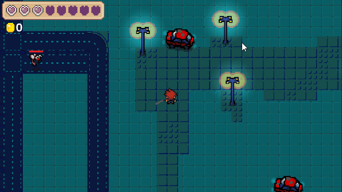
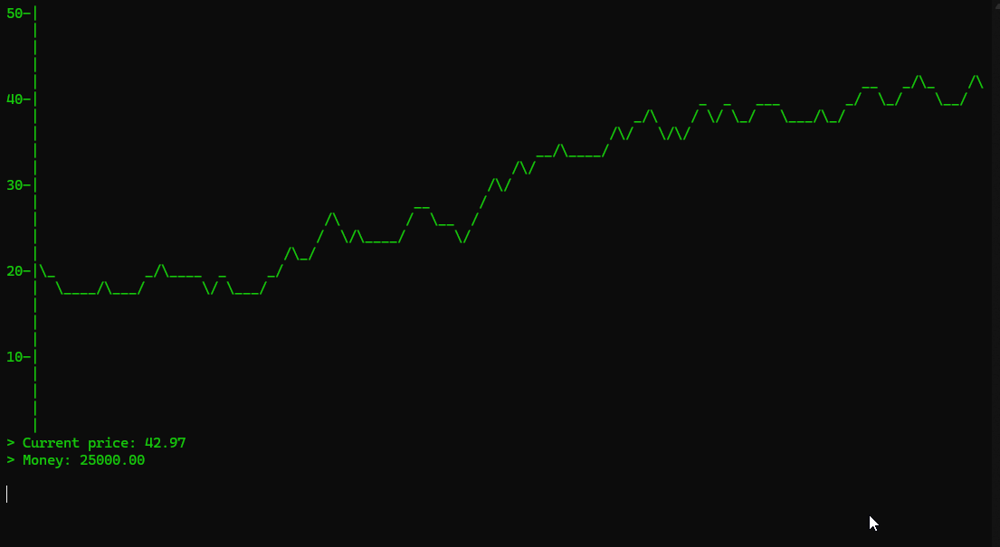

<h1 align="left">Hey, I'm Heather Carter 👋</h1>

- 🌱 I’m currently learning **OpenGL**

- 📫 How to reach me **heathercarter2006@outlook.com**
<h2 align="left">Portfolio:</h2>

  
  

<h2 align="left">Languages & Software:</h2>

  <a href="https://skillicons.dev">
    
     
    
  </a>

<h2 align="left">Connect with me:</h2>

